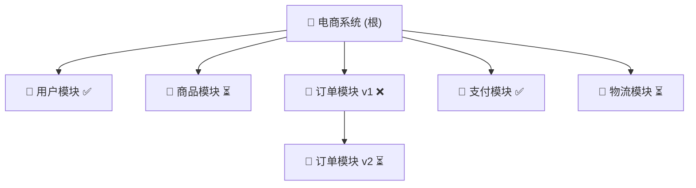

# 时间线的剪枝者

> 让 Agent 通过 Fork + 异步会话编排，自主探索工程化的系统性大任务。

---

## 一、核心隐喻

每一个 Agent 会话是一条**时间线**。Fork 就是这条时间线上长出的**分支**。

```
任务树:
                    [根任务]
                  /    |    \
             Fork1   Fork2   Fork3    ← 广度探索（拆分子任务）
             /  \
        Fork1a  Fork1b               ← 深度探索（细化）
          ❌       ✅
                  /  \
            Fork1b1  Fork1b2         ← 继续深度
```

- **Git 的每次提交 = 一个成功的工作状态点**
- **Fork 一个会话 = 从某个成功的检查点开一条新的探索分支**
- **剪枝 = 放弃失败的探索路径，回退到上一个成功点重新来**

## 二、搜索策略：广度优先 + 深度跟进

```
          广度搜索（找对的方向）
               │
    ┌──────────┼──────────┐
  试A ❌     试B ✅      试C ⏳
              │
         深度探究（往下钻）
              │
         ┌────┼────┐
       B1 ✅  B2 ❌  B3 ✅
        │
      继续...
```

1. **分解**：根任务拆成 N 个子任务，每个 Fork 一条时间线
2. **广度**：同时探索多条路径（并行 Fork + 异步 send_message）
3. **评估**：每条分支完成后，判断成功/失败
4. **剪枝**：失败的分支直接丢弃（Fork 不保留），成功的分支保留为检查点
5. **深度**：从成功的检查点继续 Fork，深入下一层
6. **递归**：直到任务完成或所有可行路径耗尽

## 三、技术实现：基于 MCP 会话工具的自主探索

### 3.1 现有能力

| 能力 | MCP 工具 | 对应隐喻 |
|---|---|---|
| 创建探索分支 | `fork_session` + `send_message(notify)` | 从检查点开新时间线 |
| 并行探索 | 多次 `send_message(notify)` 不阻塞 | 广度优先搜索 |
| 异步回收结果 | `onComplete` → 通知源会话 | 分支完成，评估结果 |
| 切换模型 | `fork_session(new_model)` | 不同探索用不同"大脑" |
| 失败回溯 | 回退到上一个 `up_to_message_uuid` 重新 Fork | 剪枝 + 重试 |

### 3.2 源会话（调度中心）的工作流

```
用户: "帮我实现一个用户登录系统"

源 Agent:
  ┌─ 1. 分解任务：
  │    Fork(A, "数据库设计")     → notify
  │    Fork(B, "API 接口设计")   → notify
  │    Fork(C, "前端表单实现")   → notify
  │
  ├─ 2. 等待通知... 源会话空闲
  │
  ├─ 3. A 完成通知："数据库 schema 已完成 → /src/db/schema.sql"
  │    ✅ 提交 + 标记为成功检查点
  │
  ├─ 4. B 完成通知："遇到问题，ORM 选型不确定"
  │    ❌ 剪枝 → Fork(B', "用 Prisma 重新设计 API")
  │
  ├─ 5. C 完成通知："前端表单已完成 → /src/components/LoginForm.tsx"
  │    ✅ 提交 + 标记
  │
  └─ 6. B' 完成通知："API 接口完成 → /src/api/auth.ts"
       ✅ 全部子任务完成 → 通知用户
```

### 3.3 搜索树的数据结构

源会话在 `.context/task-tree.md` 中维护任务树状态：

```markdown
## 任务: 用户登录系统

### 状态: 进行中

- [x] 数据库设计 (session: xxx-A) → ✅ `schema.sql`
- [ ] API 接口
  - [x] 尝试1: ORM 选型 (session: xxx-B) → ❌ 剪枝
  - [ ] 尝试2: Prisma (session: xxx-B') → ⏳ 进行中
- [x] 前端表单 (session: xxx-C) → ✅ `LoginForm.tsx`
```

### 3.4 剪枝决策

源 Agent 评估每条分支的完成通知后：

| 评估 | 操作 | 原因 |
|---|---|---|
| 输出正确 + 通过检查 | 提交 Git，标记 ✅，继续 Fork 深度 | 成功检查点 |
| 输出有错误/不完整 | Fork 从失败前的 uuid 重试，原分支丢弃 | 回溯 |
| 方向错误/死胡同 | 直接丢弃，选择其他广度路径 | 剪枝 |
| 需要不同模型 | `fork_session(new_model, new_channel)` | 换"大脑"重试 |

## 四、与传统开发的对比

| | 传统开发 | 时间线剪枝 |
|---|---|---|
| 探索成本 | 人手动开分支、尝试、回退 | Agent 自动 Fork + 异步编排 |
| 并行度 | 受限于人的注意力 | N 个 Agent 会话并行探索 |
| 回溯 | 手动 `git checkout` + 记忆上下文 | Fork 保留完整上下文，一键回退 |
| 失败处理 | 人判断 + 手动重试 | Agent 自动剪枝 + 重试 |
| 模型选择 | 固定 | 不同分支可用不同模型（性价比/能力） |

## 五、关键技术栈

```
应用层:  MCP session 工具 (fork_session / send_message / list_sessions)
         │
调度层:  源 Agent (任务分解 + 结果评估 + 剪枝决策)
         │
执行层:  N 个目标 Agent 会话 (并行 + 异步)
         │
持久层:  Git (提交检查点) + AgentSessionMeta (Fork 源记录)
```

## 六、树的生长：叶子、分叉、果实

### 6.1 树的隐喻升级

```
                     🌳 任务树
                     │
              ┌──────┼──────┐
           分支A   分支B   分支C       ← Fork = 树杈长出
             │       │       │
            🍃      🍃      🍃        ← 叶子 = 激活的子 Agent
             │       │       │
             │     子B1    🍎(果实)    ← 果实 = 已完成的可交付物
             │       │
            🍎    子B2 ❌(枯萎)        ← 枯萎 = 剪枝
```

| 隐喻 | 对应实体 | 说明 |
|---|---|---|
| 🌱 **种子** | 用户的需求描述 | 一切从这里开始 |
| 🌳 **树干** | 根 Agent 会话 | 调度中心，不休眠 |
| 🌿 **树枝** | Fork 出的目标会话 | 一个子任务探索方向 |
| 🍃 **叶子** | 当前激活的 Agent | 正在执行中的并发点 |
| 🍎 **果实** | 完成的可交付物（文件/代码/设计） | 通过验证的成功输出 |
| 🥀 **枯萎** | 失败的分支（剪枝） | 方向错误、产出不合格 |
| ✂️ **园丁** | 用户 / 根 Agent | 决定哪里长、哪里剪 |

### 6.2 树的生长过程

```
阶段 1: 播种
  用户: "我要做一个电商系统"
  根 Agent: 分析 → 拆解为 5 个子任务
  🌱 → 🌳

阶段 2: 抽枝（广度展开）
  根 Agent Fork ×5，每个子任务一个分支
  每个分支 send_message(notify) → 变为激活叶子 🍃
  🌳 ─┬─ 🍃(用户模块)
      ├─ 🍃(商品模块)
      ├─ 🍃(订单模块)
      ├─ 🍃(支付模块)
      └─ 🍃(物流模块)

阶段 3: 结果（深度收敛）
  订单模块完成 → 🍃 → 🍎
  支付模块完成 → 🍃 → 🍎
  用户模块失败 → 🍃 → 🥀(剪枝)
                     └→ Fork 重新探索 → 🍃 → 🍎
  商品模块完成 → 🍃 → 🍎
  物流模块完成 → 🍃 → 🍎

阶段 4: 丰收（整合合并）
  全部 🍎 就位
  根 Agent Fork 一个"整合会话"，用最强模型
  将 5 个果实的产出合并为一个完整系统
  🍎+🍎+🍎+🍎+🍎 → 🧺(交付)
```

### 6.3 并行激活点控制

```
当前树状态:
  🌳
  ├─ 🍃(激活)    ← 正在跑
  ├─ 🍃(激活)    ← 正在跑
  ├─ 😴(休眠)    ← 已 Fork 但未 send_message
  ├─ 🍎(已结果)  ← 完成，等待整合
  ├─ 🥀(已枯萎)  ← 失败，已剪枝
  └─ ⏳(排队)    ← 等待 API 配额释放

根 Agent 的并行调度:
  - 同时激活上限 = min(API 配额, 任务独立性, 用户预算)
  - 一个结果 → 释放一个槽位 → 队列中的下一个进入激活
  - 同一模型渠道串行排队，不同渠道可并行
```

### 6.4 可视化：用户眼中的树

理想状态下，用户在 Proma 侧边栏看到的不是扁平会话列表，而是一棵**实时生长的树**：



- 绿色 🍎 = 果实已成熟，可以查看产出
- 闪烁 🍃 = 正在激活运行中
- 灰色 🥀 = 已剪枝，保留日志但不再活跃
- 根 🌳 = 调度中心，始终活跃

## 七、整合阶段：从果实到交付

### 7.1 整合方式

| 方式 | 场景 | 实现 |
|---|---|---|
| **Git 合并** | 每个果实是一个分支，产出文件 | 根 Agent 执行 `git merge` 各分支 |
| **超级会话整合** | 果实产出分散在不同会话 | Fork 一个"整合会话"，用超强模型汇总所有上下文 |
| **人工审计** | 需人工判断的交付物 | 果实标记为待审核，用户确认后合并 |

### 7.2 整合会话的 Prompt

```
你是一个整合 Agent。以下是从 N 个子任务收集的产出：

[会话A 产出] ... 
[会话B 产出] ...
[会话C 产出] ...

请将这些产出合并为一个完整的交付物。处理冲突、统一风格、
补充缺失的连接逻辑，输出最终版本。
```

## 八、待实现能力

### 基础层（当前已具备）
- [x] Fork 分支（`fork_session`）
- [x] 异步并行（`send_message(notify)`）
- [x] 跨模型探索（`fork_session(new_channel, new_model)`）
- [x] 源会话通知回收（`onComplete` → `runAgentHeadless`）

### 调度层
- [ ] **树状态文件**：根 Agent 在 `.context/task-tree.md` 中自动维护树状态
- [ ] **剪枝决策**：根 Agent 根据输出质量自动判断 ✅/❌
- [ ] **并行槽位管理**：控制同时激活分支数上限，排队机制
- [ ] **递归深度控制**：设定最大树深度，防止无限展开

### 可视化层
- [ ] **树形侧边栏**：Proma 中将会话列表渲染为树形结构
- [ ] **实时状态**：🍃闪烁 / 🍎绿色 / 🥀灰色 的动态 UI
- [ ] **产出预览**：点击果实直接查看交付物
- [ ] **Mermaid 导出**：将当前任务树导出为 Mermaid 图

### 整合层
- [ ] **Git 自动合并**：果实产出 → 自动 commit → 根 Agent `git merge`
- [ ] **超级会话整合**：Fork 一个超强模型会话，汇总所有果实上下文
- [ ] **人工审计节点**：关键果实标记待审核，用户确认后放行

## 九、上下文甜点与自动交接

### 9.1 核心问题

每个模型都有一个**上下文甜点区**——在这个范围内推理质量最佳，超出后注意力稀释、质量下降：

| 模型 | 标称上下文 | 甜点区 | 超出甜点后 |
|---|---|---|---|
| DeepSeek V4 Pro | 1M | 150K ~ 250K | 长尾信息遗漏概率升高 |
| DeepSeek V4 Flash | 1M | 80K ~ 150K | 复杂推理退化 |
| Claude Sonnet 4.6 | 1M | 100K ~ 200K | 中间信息检索精度下降 |
| GLM-5-Turbo | 128K | 50K ~ 80K | 超出即截断或幻觉高发 |

如果不加控制，Agent 会在甜点区之外继续工作，产出质量下降且不自知。

### 9.2 解决方案：竹节式自动交接

**不是换一个分支，而是同一分支被"劈了一截"，继续延长：**

```
同一枝杈上的竹节式生长:

  🍃 会话-1 (0 → 200K)
       │  接近甜点上限
       ▼
  🔌 自动交接: Fork + 压缩上下文
       │
  🍃 会话-2 (0 → 200K)  ← 同一枝杈的第二节
       │  又接近上限
       ▼
  🔌 自动交接
       │
  🍃 会话-3 (0 → 200K)  ← 第三节
```

新旧会话是父子关系，共享同一任务目标，只是上下文换了一截。旧的保留为 🎋（竹节节点），不继续增长。

### 9.3 交接流程

```
1. 根 Agent 监控各活跃分支的上下文使用量

2. 触发条件: estimated_context_tokens 达到甜点区上限的 85%

3. 交接动作:
   a. 向当前会话发: "将进度和关键发现总结为任务简报（< 2K tokens）"
   b. 等待当前轮完成，获取简报
   c. Fork 当前会话（从最后一个成功检查点）
   d. 新会话上下文 = 原始任务描述 + 简报 + 已产出文件列表
   e. send_message(新会话, "继续任务，上下文已压缩")
   f. 旧会话标记 🎋 → 新会话标记 🍃
   g. 链式记录: session-2.parent = session-1
```

### 9.4 树上的表达

```
  🌳
  ├─ 🍎(用户模块)
  └─ 🎋(支付-节1) → 🎋(支付-节2) → 🍃(支付-节3)
                                              │
                                       上下文: 120K/200K
                                       继续工作中...
```

### 9.5 监控逻辑（根 Agent 调度循环中）

```
每轮检查:
  for active in active_branches:
    ctx = SDK 返回的 context_usage
    limit = model_sweet_spot[active.model].upper
    
    if ctx > limit * 0.85:    // 提前预警
      schedule_handoff(active)
    if ctx > limit:           // 强制交接
      force_handoff(active)
```

### 9.6 可配置甜点表

```json
{
  "deepseek-v4-pro":    { "min": 150000, "max": 250000, "hard": 400000 },
  "deepseek-v4-flash":  { "min": 80000,  "max": 150000, "hard": 200000 },
  "claude-sonnet-4-6":  { "min": 100000, "max": 200000, "hard": 300000 },
  "glm-5-turbo":        { "min": 50000,  "max": 80000,  "hard": 100000 }
}
```

## 十、其他补充建议

### 10.1 树枝间直接通信

支持 DAG 式依赖，无需通过根中转：

```
🍃(DB设计) ──产出──→ 🍃(API开发)
```

`send_message` 加 `reply_to` 参数即可。

### 10.2 果实审计

```
🍃(任务) → 完成 → Fork 审计会话（强模型 + 严格 prompt）
                        ↓
                    ✅ 通过 → 🍎
                    ❌ 不通过 → 退回重做
```

### 10.3 树的持久化与灾难恢复

维护 `tree-state.json`，完整记录树形结构和竹节链。根 Agent 崩溃后可从状态文件重建，不丢失进度。

### 10.4 渐进式交付

不等所有果实成熟——每成熟一个就通知用户一次。用户边看边用，获得感更强。

## 十一、概念总结（更新版）
