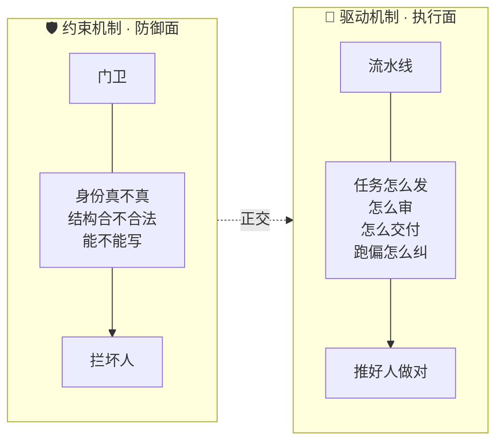
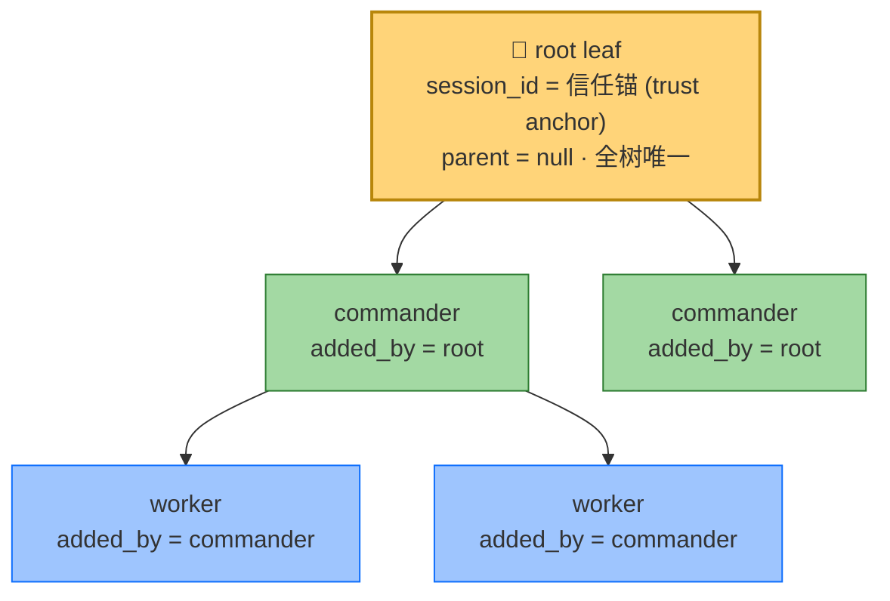
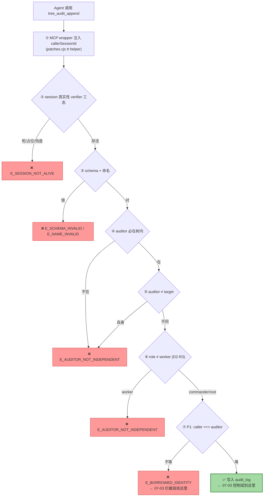
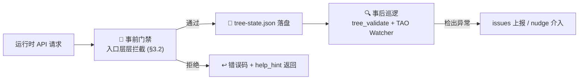
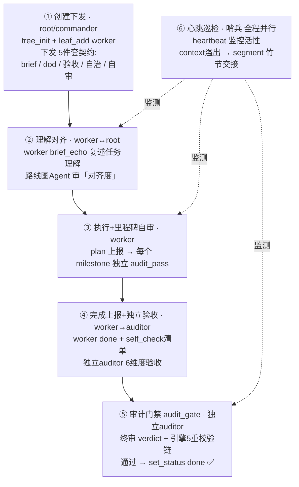
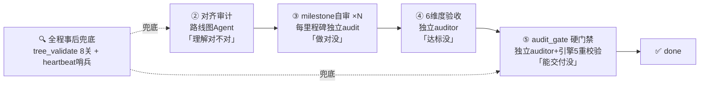
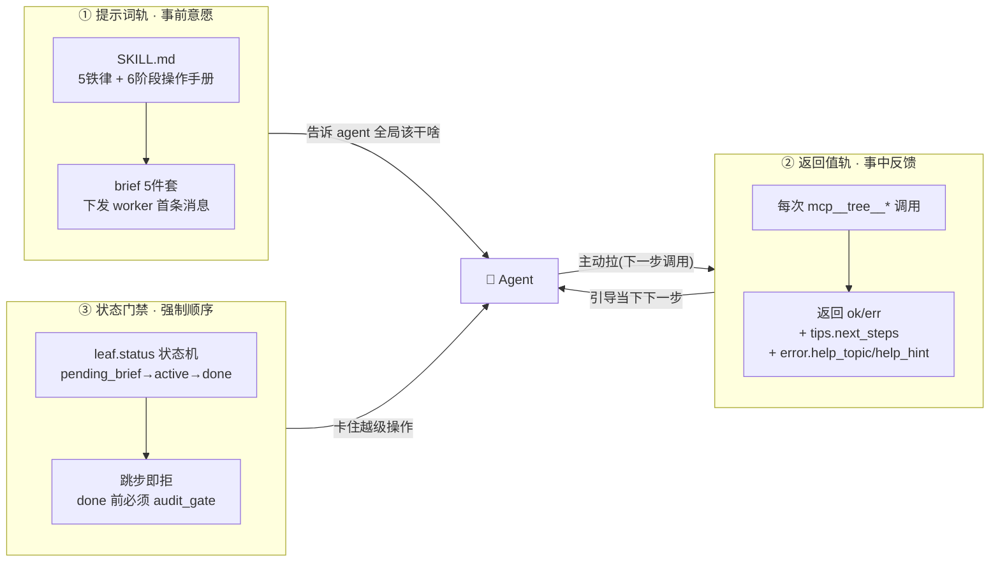
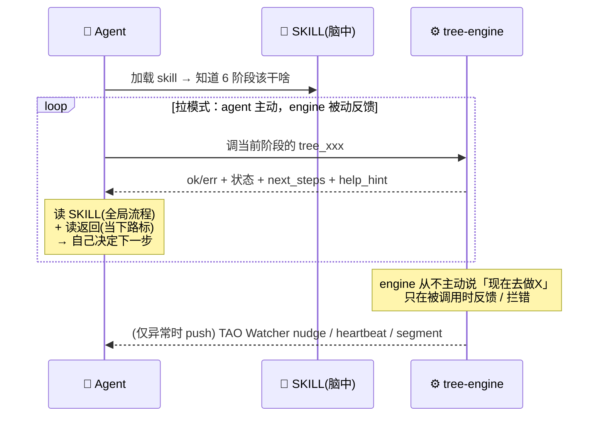

# Tree 体系运行机制总览 — 图形化心智模型

> 维护：周星星 / Proma Agent | 创建：2026-07-03
> 定位：**图形化总览 + 导航枢纽**（不是再一份契约规范）
> 来源：2026-07-03 会话四轮机制问答的整理沉淀（约束 → 驱动 → 实现 → 实测）

---

## §0 这份文档是什么

### 0.1 为什么需要它

Proma Tree 体系的机制散落在多份文档里——生命周期规范、SKILL 操作手册、改造架构文档、各轮安全论证。每份都深入但视角单一。新人或新会话要建立**完整心智模型**，得跨读 4–5 份文档。

本文把**约束、驱动、实现三个视角图形化整合**，目标是 10 分钟建立模型，再按 §8 导航按需深入。

### 0.2 与现有文档的关系（不重复造轮子）

| 现有文档 | 聚焦视角 | 本文关系 |
|---|---|---|
| `worker-lifecycle-spec-2026-06-27.md` | worker 6 阶段生命周期**契约**（权威） | §4 驱动机制图形化引用，细节查原文 |
| `skills/tree-commander/SKILL.md` v2.2 | commander **操作手册**（提示词层） | §5.1 提示词轨的源头 |
| `ARCHITECTURE.md` | **改造架构**（三层代码叠加 + Layer 0–4 防御） | 正交视角，本文聚焦"运行机制"而非"代码部署" |
| `R4-justification-2026-06-27.md` | 占位 UUID 攻击链**安全论证**（历史教材） | §3 约束机制的案例来源 |
| `note.md` | 项目演进**时间线笔记** | 实测证据来源 |

**本文补充（现有文档的补集）**：图形化门禁流水线、三轨统一模型、拉/推模式、p1chk 实测证据、心智模型速记。

---

## §1 一句话本质

> **Tree 体系 = 以 root session 为信任锚（trust anchor）的有向树 + 两套正交机制。**

- **约束机制**（防御面）：身份真实 → 结构合法 → 权限匹配 → 审计独立，**层层门禁拦坏人**
- **驱动机制**（执行面）：brief 契约下发 → 6 阶段推进 → 多重审计 → `audit_gate` 硬门禁通过才允许 done，**推好人把事做对**

两套机制**正交**：约束管"不能做什么"，驱动管"怎么协作完成"。合起来既灵活又难作弊。

---

## §2 两套正交机制（总览）



**一句话对比**：约束 = 门卫（§3），驱动 = 流水线（§4），实现 = 三轨协同落地（§5）。

---

## §3 约束机制（防御面 — "不能做什么")

### 3.1 树结构与角色



**结构铁律**：
- `leaf_id = <prefix>-<path段>-<role>`（如 `p1chk-A-commander`），违反 → `E_NAME_INVALID`
- `role ∈ {root, commander, worker}`，worker 不能有子 leaf，commander 嵌套 ≤3 层
- 一个 session 只能挂一个 leaf（`E_DUPLICATE_SESSION_ID`）
- `path` 字段是路径段（如 `"A"`），不是 leaf_id 列表

### 3.2 门禁流水线 — 以 `audit_append` 为例

一次 API 调用从入口到落盘要过一道道关卡。下图是 2026-07-03 实测走过的 `cmdAuditAppend` 完整路径（控制组通过、拦截组挂在第⑦关）：



> **教学要点**：第 ⑦ 关是 P1 防借身份补强（commit `4cee874`, engine L2716）。msg 特征串 `align with audit_gate caller binding`。详见 §6 实测证据。

### 3.3 约束全景表

| 维度 | 关键约束 | 失败错误码 |
|---|---|---|
| **结构** | leaf_id 命名 / parent 链一致 / role 层级 / worker 无子 / depth≤3 | `E_NAME_INVALID` `E_SCHEMA_INVALID` |
| **身份** | added_by 必是树内 leaf · session 真实性 verifier · `caller===added_by`(leaf_set/audit_gate) · `caller===auditor`(audit_append) | `E_BORROWED_IDENTITY` `E_SESSION_NOT_ALIVE` `E_INVALID_UUID_STRICT` |
| **审计** | auditor ≠ worker · ≠ self · audit_log 数值一致 · audit_gate 需独立通过 | `E_AUDITOR_NOT_INDEPENDENT` |
| **ownership**（层1 patches） | send/fork/archive 的自循环/下行/上行/多跳 + delegationDepth 防递归 | `E_NO_OWNERSHIP` `E_DELEGATION_TOO_DEEP` |
| **事后巡逻** | `tree_validate` 批量体检 + TAO Watcher 心跳 | issues 列表 / nudge |



**约束的本质**：事前门禁（入口拦截）+ 事后巡逻（validate/Watcher 兜底）双层。

---

## §4 驱动机制（执行面 — "怎么协作完成"）

> 权威依据：`worker-lifecycle-spec-2026-06-27.md`（6 阶段 / 25 事件 / 8 道审计关 / 7 类参与者）。本节是它的图形化摘要，细节查原文。

### 4.1 6 阶段驱动主循环



**关键设计**：不是 worker 自己说"完成了"就算数。`set_status(done)` 会被引擎**拒绝**（必须先过 audit_gate）——**驱动权在独立 auditor 手里，不在执行者手里**。这是它防"信任 worker 自报"的核心。

### 4.2 多重审计（8 道关，层层独立、互相不能省）



**"多重"的本质**：执行者(worker)自检 ≠ 验收者(auditor)验收 ≠ 门禁(audit_gate)放行，三者由**不同 session** 担任，且 audit_gate 的 auditor 必须独立于被审计 leaf（§3.2 第⑦关 P1 就是堵这里冒充）。

### 4.3 异常纠偏（卡住 / 跑偏 / 续命）

驱动不是只往前，还有**纠偏回路**保证不卡死：

| 机制 | 触发 | 动作 |
|---|---|---|
| **drift 3 档纠偏** | worker 跑偏/超时/质量差 | `nudge`(催) → `limit`(限) → `prune`(剪掉 + `fork` 新 leaf 重派) |
| **segment 竹节交接** | worker 上下文将溢出 | `segment_append` 换新 session 续命，保留完成进度 |
| **heartbeat 哨兵** | 全程并行 | 哨兵判定矩阵监控，异常触发 nudge/segment |
| **TAO Watcher nudge** | 规则触发 | 自动催办（`INVALID-RULE-99` 探针可验证 patches 生效） |

### 4.4 交回任务（收口）

```
所有 worker done → commander 验收收口 → commander 自己 done → root 归档/交付
                ↑                              ↑
        audit_gate 硬门禁把关          root 是 trust anchor，最终背书
```

**trust 自上而下授权**（root→commander→worker），**成果自下而上回流并逐层审计收口**——这就是驱动方向。

---

## §5 实现机制（怎么落地 — 驱动靠 prompt 还是 engine 返回值？）

**答案：三轨协同，缺一不可。** 你以为的"提交状态时返回告诉他下一步做什么"是其中一轨（返回值轨），但单靠它不够，还要提示词轨 + 状态门禁。

### 5.1 三轨协同模型



**三轨分工**：提示词管"知道做什么" / 返回值管"现在做什么" / 状态门禁管"必须按顺序做"。

**返回值轨的活证据**（07-03 实测）：

| 场景 | 引擎返回的引导 |
|---|---|
| `tree_init` 成功 | `tips.next_steps`（4 条建议）+ `skill_reference` + `pro_tip` |
| `leaf_add` 命名错 | `error.help_topic: naming_convention` + `help_hint` 指路 `tree_help(...)` |
| `audit_append` 被拦 | `error.help_topic: self_audit_forbidden` + 指路 |
| `tree_help(topic)` | 结构化"路标"（调用签名 → 命名 → 字段 → 常见失败 → 关联 topic）|

### 5.2 拉模式（主）vs 推模式（辅）



**关键洞察**：engine 是**被动反馈**，不主动指挥。它不会主动催 agent "现在去做 audit_gate"——只在 agent 调用时返回结果 + 暗示。**真正"知道下一步做什么"的主动权在 agent**（靠 SKILL prompt）。engine 只负责：**做对了放行+给路标，做错/越级了拦+指路**。

唯一的"推模式"是异常巡逻：TAO Watcher（nudge 催办）、heartbeat（哨兵）、segment（context 溢出续命）。

### 5.3 三权分立设计哲学

| 方案 | 问题 |
|---|---|
| 纯 prompt 驱动 | agent 会偷懒/跑偏/谎报完成 |
| 纯 engine 主动调度 | engine 要懂业务逻辑、耦合重、不灵活 |
| **Tree 体系：prompt(意愿) + 返回值(路标) + 状态机(门禁)** | agent 有自主性，但越界必被拦；engine 保持简单被动 |

**这就是它"既灵活又难作弊"的根源**：信任 agent 的主动性（prompt 赋能），但不信任它的自报（状态门禁 + 独立审计验证）。

---

## §6 实测证据 — p1chk tree（2026-07-03，release 实例重启后）

验证目标：证明 P1 防借身份补强（commit `4cee874`）在 release 运行实例真实生效（不只 dist 同步，是运行时行为）。

**实验设计**：控制组（caller===auditor）vs 拦截组（caller 借用他人 session 当 auditor），对比通过/拦截。

| 组别 | 调用 | 结果 |
|---|---|---|
| **控制组** | 我(`ee435ed8`) 审 `p1chk-A-commander`，auditor=我自己 | ✅ `ok:true`，audit_log 正常写入 |
| **拦截组** | 我(`ee435ed8`) 借用 `1cba319d` 当 auditor 审 `p1chk-root` | 🛡️ `E_BORROWED_IDENTITY` 拦截 |

拦截组返回 msg：
> `caller "ee435ed8..." != auditor_session_id "1cba319d..." (borrowed identity forbidden; caller must be the auditor itself — align with audit_gate caller binding)`

`align with audit_gate caller binding` 正是 P1 补强（engine L2716）的特征字符串。

**结论**：证明全链路在 release 运行实例生效——patches.cjs MCP wrapper `callerSessionId` 注入 → engine `dispatchAudit` 透传 → `cmdAuditAppend` caller≠auditor 拦截。这条 tree（`p1chk`）+ standin 会话（`1cba319d`）保留作 §3.2 门禁流水线的活教材。

---

## §7 关键心智模型（速记）

1. **trust anchor = root session**：全树唯一不证自明的信任源，所有授权自它流出。
2. **两套正交机制**：约束（门卫，拦坏人）× 驱动（流水线，推好人），别混为一谈。
3. **身份真实性是根因 A**：session verifier（三态）取代占位 UUID 拒绝，从源头防伪造。
4. **防借身份（caller 绑定）**：`caller===auditor` / `caller===added_by`，MCP 层注入 callerSessionId，agent 无法伪造。
5. **状态门禁强制顺序**：`leaf.status` 状态机，跳步（如未 audit_gate 就 done）必被拒。
6. **多重审计不同 session**：执行者自检 ≠ 验收者验收 ≠ 门禁放行，三者身份独立。
7. **拉模式为主，推模式为辅**：engine 被动反馈（路标），只在异常时主动 push（nudge/segment）。
8. **事前门禁 + 事后巡逻**：入口拦截为主，`tree_validate` + TAO Watcher 兜底。
9. **三权分立**：prompt 管"意愿"，返回值管"路标"，状态机管"顺序"——agent 有自主性但越界必拦。
10. **信任主动性，不信任自报**：赋能 agent 自己推进，但成果必须独立审计验证才采信。

---

## §8 深入阅读导航

| 想深入了解 | 去读 |
|---|---|
| worker 6 阶段每步的精确契约（5 件套字段、事件路由、状态机转换）| `worker-lifecycle-spec-2026-06-27.md` §3–§10 |
| commander 操作指令（5 件套 YAML 模板、铁律、禁止行为）| `skills/tree-commander/SKILL.md` v2.2 |
| 改造架构（三层代码叠加、11 补丁、Layer 0–4 防御）| `ARCHITECTURE.md` |
| 占位 UUID 攻击链的完整威胁建模与金标准兼容论证 | `R4-justification-2026-06-27.md` |
| 项目演进时间线 + 每轮修复决策 | `note.md`（顶部最新）|
| 引擎工具签名 / 错误码全表 | `mcp__tree__tree_help('full_guide')` + lifecycle-spec §11 |
| 命名规范 / auditor 注册 / 常见错误 | `tree_help('naming_convention' / 'how_to_register_auditor' / 'common_mistakes')` |

---

*本文为图形化总览，契约细节以各权威文档为准。机制演进时同步更新本文 + 对应规范。*
