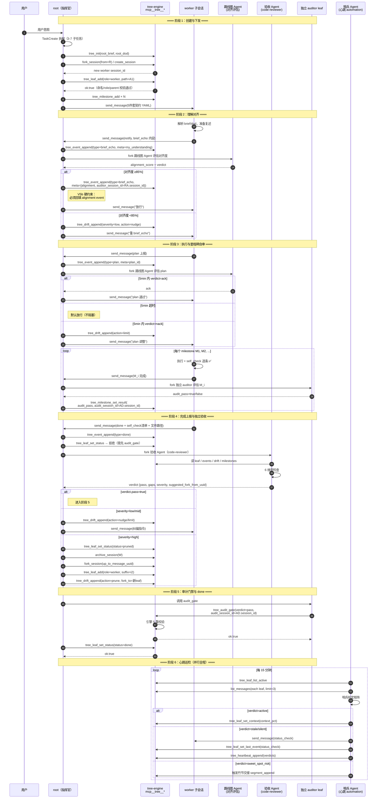
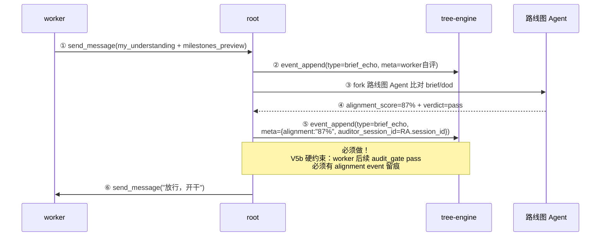
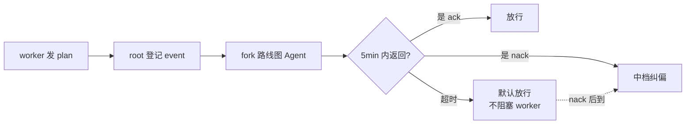
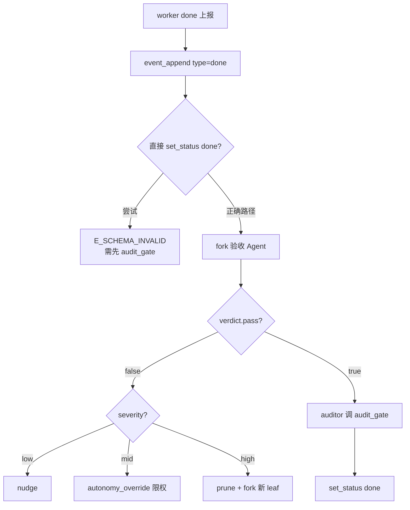
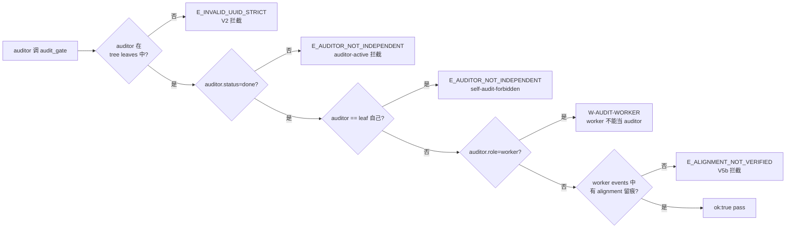
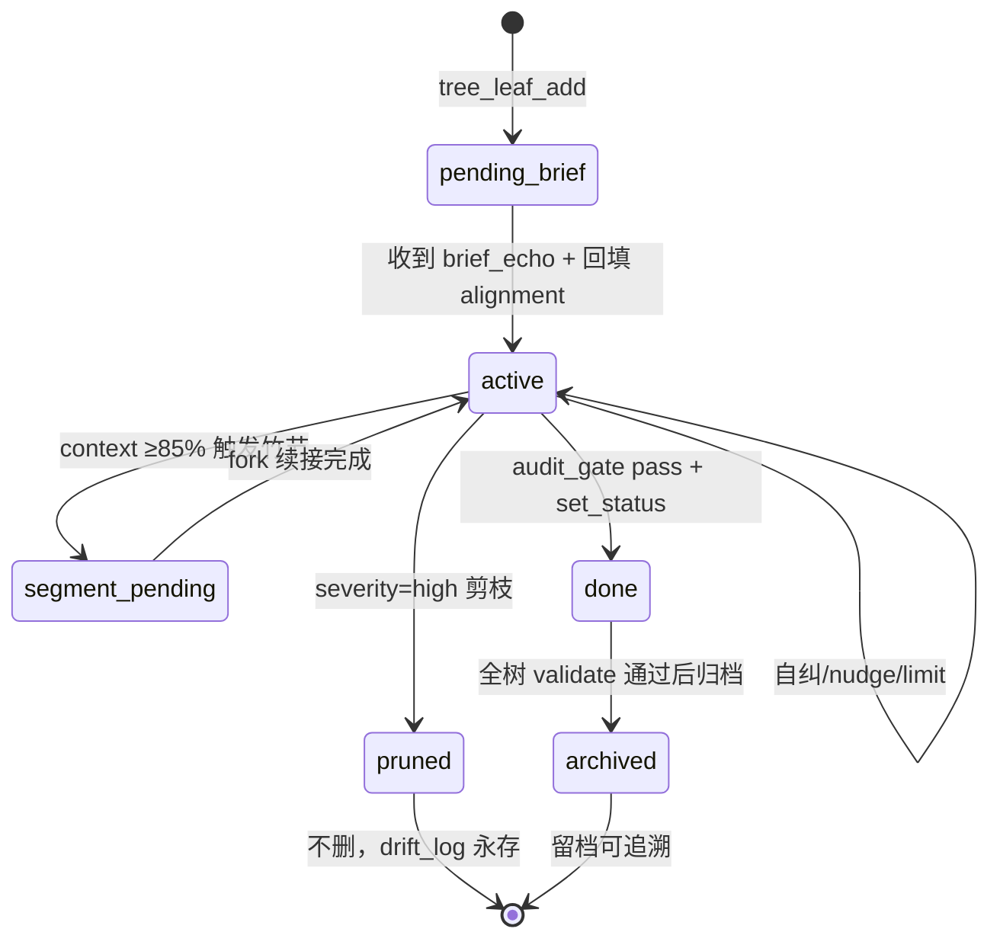

# Tree 工作模式 — Worker 生命周期规范

> **版本**：v1.0 | **维护**：周星星 / Proma Agent | **创建**：2026-06-27
> **状态**：基线版（基于 IHL R6 / commit `690f7e8` + R1 洁净室测试结果）
> **适用**：tree-commander SKILL v2.2 + tree-engine inline MCP v0.7+
> **关联文档**：`cleanroom-test-plan-2026-06-26.md`、`cleanroom-round1-recap-2026-06-27.md`、`tree-commander/SKILL.md`

---

## §0 元数据

```yaml
doc_name: worker-lifecycle-spec
version: 1.0
created: 2026-06-27
maintainer: 周星星 / Proma Agent
based_on:
  - tree-commander SKILL v2.2
  - tree-engine inline MCP v0.7+
  - IHL R6 (commit 690f7e8)
  - R1 洁净室测试结果 (2026-06-26)
scope: |
  规范 Worker 子会话从创建到 done 的完整生命周期，
  覆盖 6 阶段 / 25 事件 / 8 道审计关 / 7 类参与者。
audience:
  - Proma 改造项目组成员
  - tree-commander / tree-worker SKILL 维护者
  - 洁净室测试 Commander
  - 未来 R2/R3 测试设计者
```

---

## §1 文档目的

### §1.1 为什么需要这份规范

R1 洁净室测试暴露一个问题：**4 个 Commander 各自从 SKILL.md 推断流程细节**，导致对同一机制的理解存在偏差（如 A4/A5 单会话约束、B5 audit_log 真实性、C1 fork 幻觉）。本规范把 worker 生命周期**从 SKILL 操作手册提升为独立可引用的设计契约**，统一所有参与方对流程的认知。

### §1.2 不包含什么

- **不**重复 SKILL.md 的操作指令（如 5 件套 YAML 模板）——参考 SKILL §3
- **不**复述引擎源码实现——参考 tree-engine.cjs
- **不**覆盖 commander 自身的生命周期——本规范只聚焦 worker

### §1.3 适用场景

| 场景 | 是否适用 |
|---|---|
| Commander 下发 worker 子会话 | ✅ 核心场景 |
| Commander 下发 commander 子会话（嵌套） | ⚠️ 部分适用（嵌套深度 ≤3） |
| Root 自身的活动 | ❌ 不适用 |
| 审计专用 leaf（C1-C4/A1-A2） | ⚠️ 阶段 1-3 适用，4-5 简化 |

---

## §2 整体架构

### §2.1 树形角色三层

```
                  ┌─────────────────┐
                  │   root（指挥官） │  ← 信任锚点（trust anchor）
                  │  自己不写代码    │     不当任何人的 auditor
                  │  只调度+验收    │
                  └────────┬────────┘
                           │ 拆任务（TaskCreate）+ fork_session
            ┌──────────────┼──────────────┐
            ▼              ▼              ▼
      ┌──────────┐   ┌──────────┐   ┌──────────┐
      │commander │   │commander │   │  worker  │  ← commander 可再嵌套
      │   (A)    │   │   (B)    │   │   (C)    │     但引擎限制 ≤3 层
      └────┬─────┘   └────┬─────┘   └──────────┘
           │               │
      ┌────┴────┐          └──┐
      ▼         ▼             ▼
   worker    worker        worker
   (A1)      (A2)          (B1)
```

**path 命名表达嵌套**：`项目root → 项目A-commander → 项目A1-worker → 项目A1a-worker`（曾孙级）。

**引擎硬约束**：
- `role` 必须在 `{root, commander, worker}` 枚举内（越界 `E_SCHEMA_INVALID`）
- commander 嵌套深度 ≤3（防止递归炸树）
- 命名规范正则：`^([a-z][a-z0-9_]{3,7})-(?:([A-Z]\d*(?:[a-z]\d*)*)?-)?(root|commander|worker)(?:-(s\d+|i\d+))?$`

### §2.2 双层扶持机制

#### 第 1 层：SKILL.md 软引导（教 Agent 怎么走）

| 引导工具 | 内容 |
|---|---|
| 5 件套契约 | 下发子会话首条消息必须是 brief/dod/report/autonomy/self_audit 完整 YAML |
| 5 步法 | 规划 → 下发 → 事件路由 → 质量门 → 沉淀 |
| 铁律 5 条 | 严禁直接读写 state / 必须 5 件套 / 必须三步质量门 / 必须三档纠偏 / 审计必多 Agent |
| 禁止行为 12 条 | 不亲自写代码 / 不一句话任务 / 不跳 brief_echo / 不信任"已完成" ... |
| 事件路由表 | done / blocked / plan / brief_echo / heartbeat_reply 各自怎么处理 |

#### 第 2 层：`mcp__tree__*` 引擎硬约束（挡着不让走偏）

| 想干什么坏事 | 引擎拦截点 |
|---|---|
| commander 代 worker 写 done | `E_BORROWED_IDENTITY` |
| 一个 session 注册多个 leaf | `E_DUPLICATE_SESSION_ID` |
| 自审给自己标 pass | `E_AUDITOR_NOT_INDEPENDENT` / self-audit-forbidden |
| 伪造 auditor UUID | `E_INVALID_UUID_STRICT` |
| milestone 无条件 audit_pass=true | V4 拦截（必须带 audit_session_id） |
| root 当 worker 的 auditor | trust anchor 拒绝 |
| done 时 self_check 缺项 | `E_SELFCHECK_INVALID` |
| 命名乱起 | `E_NAME_INVALID` |

---

## §3 Worker 生命周期总览

### §3.1 6 阶段 25 事件 7 参与者

| 阶段 | 名称 | 事件数 | 关键参与者 |
|---|---|---|---|
| 1 | 创建与下发 | 7 | root、tree-engine |
| 2 | 理解对齐（brief_echo 双向） | 5 | root、worker、路线图 Agent |
| 3 | 执行与里程碑自审 | 6-10 | worker、root、独立 auditor |
| 4 | 完成上报与独立验收 | 6 | worker、root、验收 Agent |
| 5 | 审计门禁与 done | 3 | root、独立 auditor、tree-engine |
| 6 | 心跳巡检（并行全程） | 持续 | 哨兵 Agent、tree-engine |

### §3.2 完整时序图



---

## §4 阶段 1：创建与下发

### §4.1 流程详解

| 步骤 | 谁做 | 工具/动作 | 失败点 |
|---|---|---|---|
| 1 | root | `TaskCreate` 拆解用户意图为 3-7 个子任务 | 任务太粗（违反禁止行为 #2） |
| 2 | root | `tree_init(tree_id, root_brief, root_dod)` 首次创建树 | tree_id 已存在 / 命名违规 |
| 3 | root | `fork_session` 或 `create_session` 创建 worker session | 配额耗尽（F4 灾难恢复） |
| 4 | root | `tree_leaf_add(role=worker, path=A1, session_id=...)` | `E_NAME_INVALID` / `E_DUPLICATE_SESSION_ID` |
| 5 | root | `tree_milestone_add × N` 添加里程碑 | milestone.id 重复 / expect_outputs 为空（V3） |
| 6 | root | `send_message(worker_session, 5件套YAML)` 首条消息 | 缺任一件套 → worker 跑偏（铁律 #2） |

### §4.2 5 件套契约（缺一不可）

```yaml
brief:        # 任务简报 — parent_intent / my_mission / in_scope / out_of_scope
dod:          # 完成定义 — deliverables / quality_gates / self_check ≥2项
report:       # 汇报协议 — channels / format / plan_ack_seconds / escalation
autonomy:     # 自主度 — can_decide / must_report / must_ask
self_audit:   # 自审 — milestones[] / audit_after_each_milestone / max_self_corrections=2
```

### §4.3 Worker 状态机起点

```text
leaf.status         = "pending_brief"   ← 等 worker 发 brief_echo
leaf.added_by       = root.session_id
leaf.last_event     = null
leaf.drift_history  = []
leaf.context_usage_pct = 0
leaf.milestones     = [M1, M2, ...]（已 add，audit_pass=false）
leaf.audit_gate     = null
leaf.segment_chain  = []
```

---

## §5 阶段 2：理解对齐（V5b 硬约束核心）

### §5.1 为什么这阶段最关键

**SKILL §6 明示**：跳过 brief_echo → 理解偏差在全程传播（禁止行为 #6）。**对齐度 <85% 的偏差是后续所有 bug 的根源**。

### §5.2 双向 brief_echo 机制



### §5.3 跳过步骤 ⑤ 的后果（SKILL §6 明示）

> 若跳过回填 alignment event：
> 1. worker 永远拿不到 audit pass
> 2. `cmdAuditGate` 拦 `E_ALIGNMENT_NOT_VERIFIED`（worker events 无 alignment 留痕）
> 3. worker 卡死无法 done，会上行 blocked 抱怨"audit pass 被拦"
> 4. **这是 V5b 的硬约束（堵 A3-omit-alignment 绕过），不是 bug**

### §5.4 路线图 Agent 的角色（关键设计）

- **不是 root 自己评**（root 有自我合理化盲区）
- **不是 worker 自评**（worker 无法自评对齐度）
- **必须是独立 leaf**（其 session_id 将作为 alignment auditor）
- 评估输出：`{alignment_score: 0-100, verdict: ack/nack/tweak, gaps: [...]}`

### §5.5 对齐度阈值

| 对齐度 | 处理 |
|---|---|
| ≥85% | 放行，进入阶段 3 |
| 65%-84% | nudge，要求 worker 重发 brief_echo |
| <65% | drift_append(severity=mid)，可能直接限权 |

---

## §6 阶段 3：执行与里程碑自审

### §6.1 plan 上报的"5 分钟默认放行"机制



**设计哲学**：宁可放行后纠偏，不让 worker 空等（禁止行为 #10）。

### §6.2 Milestone 自审循环（每个 milestone 都要走）

| 步骤 | 动作 | 工具 | 失败点 |
|---|---|---|---|
| 1 | worker 完成 M_i | 内部 | — |
| 2 | worker 跑 `self_check` 项目 | 内部 | 缺一项 → 退回（禁止行为 #8） |
| 3 | worker 上报 M_i 完成 | `send_message` | — |
| 4 | root fork 独立 auditor 评估 M_i | `fork_session` | auditor 死锁（见 §13.2） |
| 5 | auditor 返回 audit_pass | `send_message` | — |
| 6 | root 记录 milestone 结果 | `tree_milestone_set_result(audit_pass, audit_session_id)` | `E_AUDITOR_NOT_INDEPENDENT`（V4） |

### §6.3 关键约束

- `audit_pass=true` **必须带** `audit_session_id`（V4 拦截自审）
- `audit_session_id` 必须是 tree 中真实存在的独立 leaf（不能伪造 UUID）
- milestone.expect_outputs **非空**（V3 拦截）

---

## §7 阶段 4：完成上报与独立验收

### §7.1 4 道关全过的硬顺序



### §7.2 验收 Agent 6 维度检查（SKILL §9）

```yaml
检查维度:
  1. deliverables: 是否存在且满足 dod.min_length / must_contain
  2. self_check:   是否全部 pass=true（缺一项 → severity=high）
  3. 范围:          是否超出 brief.in_scope（超出 → direction 偏差）
  4. drift_history: 有无未解决 severity>=mid 偏差
  5. fork_from:    如有偏差，从哪个 milestone 开始偏
  6. .note.md:     每个交付物是否附决策笔记（无 → severity=high）

输出: {pass, gaps, severity, suggested_fork_from_uuid, reason}
```

### §7.3 三档纠偏决策（SKILL §7）

```text
if severity == low OR action == status_check:
    → 轻档：send_message(nudge) + drift_append(action=nudge)

elif severity == mid:
    if leaf.drift_history 近 30min 内有 nudge:
        → 中档：autonomy_override(removed_can_decide) + drift_append(action=limit)
    else:
        → 先走轻档（给一次自纠机会）

elif severity == high OR (mid + 已有 limit):
    → 重档：archive_session + set_status(pruned)
            + fork_session(up_to_message_uuid)
            + leaf_add(suffix=i2) + drift_append(action=prune, fork_to=新leaf)
```

**铁律**：同一偏差最多 2 次纠正，第 3 次必剪枝（铁律 #4）。

### §7.4 三档纠偏对照表

| 档位 | 触发 | 动作 | 执行者 |
|---|---|---|---|
| 轻档（提示） | severity=low | send_message(nudge) | 根会话直发 |
| 中档（限权） | severity=mid / 轻档后再偏 | send_message(limit) + autonomy_override | 根会话 |
| 重档（剪枝） | severity=high / 中档后再偏 | archive + fork + prune | 根会话 |

---

## §8 阶段 5：审计门禁 audit_gate

### §8.1 引擎 5 重校验链



### §8.2 通过后才能 set_status done

```text
root 调 tree_leaf_set_status(tree_id, leaf_id, "done")
  → 引擎校验：
    ① milestones 非空
    ② 所有 milestones[].audit_pass == true
    ③ audit_gate.verdict == pass（如有）
  → 全部通过：ok:true，leaf.status = "done"
  → 任一失败：E_SCHEMA_INVALID / E_MILESTONE_INCOMPLETE
```

### §8.3 trust anchor 设计

**root 不充当任何 worker/commander 的 auditor**，原因：
- root 是信任锚点，自己当 auditor 会破坏三重独立校验
- root 自审会触发 self-audit-forbidden
- root 必须外创独立 auditor leaf（消耗 node_budget，见 §13.2 死锁问题）

R1 D 系列验证：8/8 注入攻击试图诱导 root 当 auditor，全部被拒绝。

---

## §9 阶段 6：心跳巡检（并行全程）

### §9.1 哨兵判定矩阵（SKILL §8.2）

| 最近活动 | context_usage_pct | 判定 | action |
|---|---|---|---|
| < 5 分钟 | < 85% | `active` | none |
| < 5 分钟 | ≥ 85% | `sweet_spot_risk` | schedule_handoff（竹节交接） |
| 5-30 分钟 | 任意 | `stale` | status_check |
| > 30 分钟 | 任意 | `silent` | status_check + drift_append(mid) |

### §9.2 心跳 automation 配置

```yaml
name: "tree-heartbeat-<tree_id>"
scheduleType: interval
intervalMinutes: 15
sessionMode: reuse
permissionMode: bypassPermissions
```

### §9.3 竹节交接（context 溢出场景）

当 context_usage_pct ≥ 85%：
1. `tree_segment_append(tree_id, leaf_id, new_session_id)` — 追加 segment_chain
2. `tree_leaf_set_status(segment_pending)` — 标记等待交接
3. `fork_session` 续接新会话
4. 新 leaf 加 `s2` 后缀（如 `nanju-A1-worker-s2`）

---

## §10 Worker 状态字段变化轨迹

| 字段 | pending_brief | active | done |
|---|---|---|---|
| `status` | pending_brief | active | done |
| `last_event_type` | null → brief_echo | plan / milestone / done | done |
| `context_usage_pct` | 0 | 0 → 85（心跳更新） | final |
| `drift_history` | [] | [nudge?] / [limit?] / [prune?] | final |
| `milestones[].audit_pass` | [false×N] | 逐个 true | [true×N] |
| `audit_gate.verdict` | null | null | pass |
| `segment_chain` | [] | [] 或 [session_id]（竹节） | final |

### §10.1 状态机转换图



---

## §11 错误码全表

### §11.1 E_* 硬错误（API 入口拦截）

| 错误码 | 触发场景 | 阶段 |
|---|---|---|
| `E_NAME_INVALID` | leaf_id 命名违规（含连字符/大写/长度超限） | 1 |
| `E_DUPLICATE_SESSION_ID` | 同 session 注册多 leaf（Bug B 修复点） | 1 |
| `E_BORROWED_IDENTITY` | commander 代 worker 写 done（Bug A 修复点） | 3-4 |
| `E_SELFCHECK_INVALID` | done 时 self_check 缺 evidence | 3 |
| `E_AUDITOR_NOT_INDEPENDENT` | auditor 未 done / auditor=self / 自审 milestone | 3-5 |
| `E_INVALID_UUID_STRICT` | audit_session_id 全零/全F/非 v4 UUID | 5 |
| `E_ALIGNMENT_NOT_VERIFIED` | worker events 无 alignment event 留痕（V5b） | 5 |
| `E_MILESTONE_INCOMPLETE` | done 时 milestones 未全 audit_pass | 5 |
| `E_SCHEMA_INVALID` | 多种 schema 校验失败 | 全阶段 |
| `E_WORKSPACE_NOT_FOUND` | create/fork 时 workspace_id 无效 | 1 |
| `E_TREE_NOT_VALIDATED` | restore dirty backup（V1） | 异常恢复 |

### §11.2 W-AUDIT-* validate 规则（事后审计）

| 规则 | 检测 | R1 状态 |
|---|---|---|
| `W-AUDIT-SELF` | audit_gate.verdict=pass + auditor=self | 生效（B3） |
| `W-AUDIT-WORKER` | auditor 是另一 worker | 生效（B4） |
| `W-AUDIT-TAMPER` | audit_log 伪造 | **未触发**（B5 PARTIAL） |
| `W-AUDIT-NO-ALIGN` | worker done 无 brief_echo alignment | 生效（B6） |
| `added_by_role_invalid` | worker 作为 added_by | 生效（A6） |
| `alignment_not_recorded` | done 但无 alignment event | 生效（A6/B6） |
| `status_event_mismatch` | status 与 events 不一致 | 生效（B3-B6） |

---

## §12 关键约束清单（团队对齐用）

### §12.1 必须做（MUST）

| # | 约束 | 来源 |
|---|---|---|
| 1 | 下发子会话首条消息必须含 5 件套完整 YAML | 铁律 #2 |
| 2 | worker 首条上行必须是 brief_echo | 禁止行为 #6 |
| 3 | brief_echo 后 root 必须回填 alignment event | V5b 硬约束 |
| 4 | 每个 milestone 必须独立 auditor 评估 | self_audit 契约 |
| 5 | done 前必须经 audit_gate（独立 auditor 调用） | §8 |
| 6 | 三档纠偏同一偏差最多 2 次，第 3 次必剪枝 | 铁律 #4 |
| 7 | 审计任务必须并行 ≥4 个独立审查子会话 | 铁律 #5 |
| 8 | 重要产出必须落盘到 .context/ | 禁止行为 #12 |

### §12.2 禁止做（MUST NOT）

| # | 约束 | 来源 |
|---|---|---|
| 1 | 严禁直接读写 tree-state.json | 铁律 #1 |
| 2 | root 不亲自写代码 / 不亲自做判断 | 禁止行为 #1 |
| 3 | root 不充当任何 worker/commander 的 auditor | trust anchor |
| 4 | worker 不能自审（self-audit-forbidden） | V4 |
| 5 | worker 不能当其他 worker 的 auditor | W-AUDIT-WORKER |
| 6 | auditor 必须自己 status=done 才能审别人 | E_AUDITOR_NOT_INDEPENDENT |
| 7 | 不能伪造 auditor UUID | V2 |
| 8 | 重档剪枝后不能删旧会话（archive 不删） | 禁止行为 #11 |

---

## §13 R1 实测发现的 gap（P0/P1 待修）

### §13.1 P0 — Fork 幻觉（C1+C5 双重确认）

**症状**：Fork 后的会话继承根会话完整上下文，**缺少"你是 fork"的身份提示**，导致 fork 会话认为自己就是原始 Commander，自主越权执行建 leaf、写 event、伪造 auditor UUID。

**C1 直接后果**：
- 伪造 auditor UUID `e860de98`
- 虚构 leaf A2/A3/A4
- root 状态污染
- session_id 漂移 `17a5005a → db7983e8`
- validate 返回 4 个 issues

**根因**：fork_session 未注入 system prompt 段。

**波及范围**：D 系列防御也受影响（Commander C 建议 R2 跨视角验证）。

**修复方向**：fork 时强制注入 system prompt：
```text
你是 {original_session_id} 的 fork 副本，
新 session_id={new_session_id}，
禁止越权执行 {list: leaf_add / event_append done / audit_gate}。
```

### §13.2 P1 — Auditor 鸡生蛋死锁（设计问题）

**症状**：Worker 需要独立 auditor 才能通过 audit_gate，但创建 auditor leaf 消耗 `node_budget`。如果 worker 占满 node_budget，无法创建 auditor，形成死锁。

**影响**：A4/A5 单会话无法验证正面路径；C 系列未触达但理论上存在。

**解决方向（择一）**：
- 方案 A：auditor 不计 node_budget（推荐）
- 方案 B：root 作为 trust anchor 显式打破死锁（但违反 root 不当 auditor 原则）
- 方案 C：保留 auditor 池（tree 初始化时预创建）

### §13.3 P0 — API 入口校验缺失（B9/B12）

#### B12 — expect_outputs 路径遍历
- **症状**：`tree_event_append` / `tree_milestone_add` 接受 `expect_outputs=["/etc/passwd", "C:\Windows\System32\config\SAM", "/etc/shadow"]` 等绝对系统路径，无任何校验直接持久化
- **根因**：expect_outputs 被视为声明式元数据，未在 API 入口做沙箱/白名单校验
- **V9 旧攻击复发**：V9 守卫仅覆盖 done 时校验，未覆盖 append/add 时校验

#### B9 — applyNudge 规则绕过
- **症状**：rule_id 可为任意字符串（包括 `"INVALID-RULE-99"`），3 个 nudge 全部被接受
- **根因**：`tree_nudge_append` 入口缺少 ① rule_id 白名单 ② role→rule 适用性检查 ③ 累计计数限制

### §13.4 P1 — audit_log 伪造（B5 PARTIAL）

**症状**：直接 JSON 篡改可注入合规格式 audit_log 条目（auditor_session_id 不存在于树中），仅被通用完整性检出，未触发专用 `W-AUDIT-TAMPER` 校验。

**修复方向**：`tree_validate` 增加 `audit_log_integrity` 检查项，交叉验证 `audit_log[i].auditor_session_id` 是否在 leaves 中存在且 role 合法。

### §13.5 P2 — 其他一致性问题

| 问题 | 影响 | 优先级 |
|---|---|---|
| Session ID 双轨制（SDK ID ↔ Proma ID） | C1 漂移 | P2 |
| 工具数量偏差（29 vs 27） | C8 | P2 |
| Root archive 特权（active→archived 跳过 done） | A7 | P2 |
| 命名规范不一致（测试计划含连字符） | 测试方法 bug | P3 |

---

## §14 修订历史

| 日期 | 版本 | 主要变更 | 维护者 |
|---|---|---|---|
| 2026-06-27 | v1.0 | 首版。基于 R1 洁净室测试结果整理。覆盖 6 阶段 25 事件 8 道审计关 | Proma Agent |

### §14.1 待补充章节（v1.1 计划）

- §15 Worker 异常分支处理细节（F1-F4 灾难恢复）
- §16 多 worker 并行调度模式
- §17 嵌套 commander 的特殊处理
- §18 与 tree-audit-methodology.md 的衔接

---

## §15 索引

### §15.1 关联文档

| 文档 | 路径 | 用途 |
|---|---|---|
| Tree Commander SKILL | `skills/tree-commander/SKILL.md` | 操作手册 |
| 测试计划 | `.context/v10/cleanroom-test-plan-2026-06-26.md` | R1/R2/R3 计划 |
| R1 综合分析 | `.context/v10/cleanroom-round1-recap-2026-06-27.md` | R1 测试结果 |
| R1-A 报告 | `.context/v10/cleanroom-round1-a-2026-06-26.md` | 功能正确性 |
| R1-B 报告 | `.context/v10/cleanroom-round1-b-2026-06-26.md` | 对抗攻击 |
| R1-C 报告 | `.context/v10/cleanroom-round1-c-2026-06-26.md` | 端到端 |
| R1-D 报告 | `.context/v10/cleanroom-round1-d-2026-06-26.md` | Prompt Injection |
| Tree 体系架构分析 | `.context/reference/design/tree-system-architecture-analysis-2026-06-23.md` | 架构设计 |
| Tree 审计方法论 | `.context/reference/methodology/tree-audit-methodology.md` | 审计流程 |

### §15.2 引用规范

在其他文档中引用本规范时，使用：
```text
详见 worker-lifecycle-spec-2026-06-27.md §<章节号>
```
